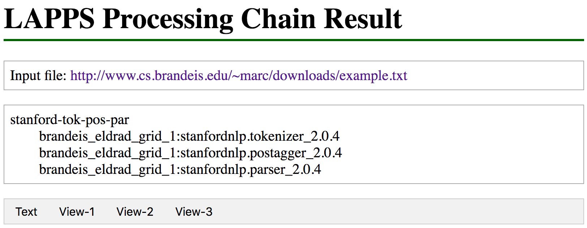

# A simple Flask application for LAPPS Services

This code implements a simple Flask web application that allows you to interact with LAPPS services and service chains.

## Requirements

Python 3.7 is recommended, but the code will probably run on Python 3.5 or 3.6. To make sure you have the right environment for the application do the following (assuming you use pip for package management):

```bash
$ pip3 install Flask
$ pip3 install Flask-RESTful
$ pip3 install requests
$ pip3 install zeep
```

All modules installed after the above are listed in `code/requirements.txt`.

Finally you need user names and passwords for the Brandeis and Vassar servers. Copy the file `code/config.sample.py` to `code/config.py` and edit as needed.


## Running the application in development mode

```bash
$ cd code
$ export FLASK_ENV=development
$ python3 app.py
```

You should see something like the following:

```
Loading LAPPS services...
Loading local cache with information for services on brandeis...
Loading local cache with information for services on vassar...
 * Serving Flask app "app" (lazy loading)
 * Environment: development
 * Debug mode: on
 * Running on http://127.0.0.1:5000/ (Press CTRL+C to quit)
 * Restarting with stat
Loading LAPPS services...
Loading local cache with information for services on brandeis...
Loading local cache with information for services on vassar...
 * Debugger is active!
 * Debugger PIN: 319-986-309
```

Note that the first time you do this you may also get a long list with notes that metadata are being retrieved, with lines like the following.

```
Retrieving metadata from anc:gate.tokenizer_2.2.0
Retrieving metadata from anc:gate.splitter_2.2.0
```

You can test the application by clicking
http://127.0.0.1:5000/run_chain?id=stanford-tok-pos-par&data=http://127.0.0.1:5000/get_file?fname=data/example.txt. You should see something like

> 

The tabs on the gray bar can be clicked to display the text or view.
